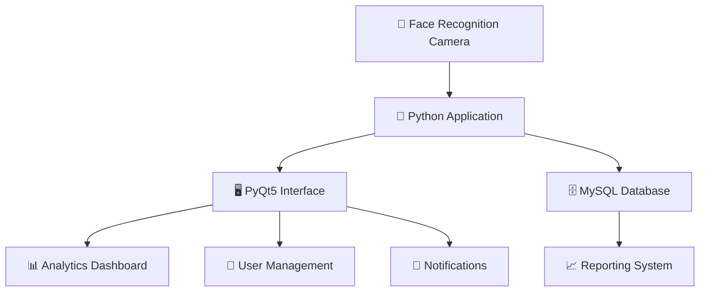
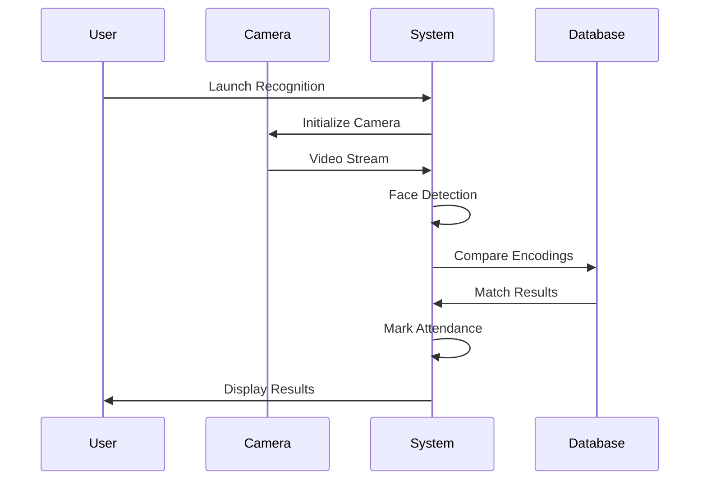

# 🎓 Absence Manager - Face Recognition Attendance System

<div align="center">


*An intelligent attendance management system powered by facial recognition technology*

[🚀 Quick Start](#-quick-start) •
[📖 Documentation](#-documentation) •
[🛠️ Installation](#%EF%B8%8F-installation-guide) •
[🤝 Contributing](#-contributing)

</div>

---

## 📋 Table of Contents

- [🌟 Features](#-features)
- [🏗️ Project Architecture](#%EF%B8%8F-project-architecture)
- [⚡ Quick Start](#-quick-start)
- [🛠️ Installation Guide](#%EF%B8%8F-installation-guide)
- [📁 Project Structure](#-project-structure)
- [💾 Database Schema](#-database-schema)
- [🚀 Usage](#-usage)
- [🐳 Docker Deployment](#-docker-deployment)
- [🤝 Contributing](#-contributing)
- [📄 License](#-license)

---

## 🌟 Features

### 🎯 Core Functionality
- **🔍 Advanced Facial Recognition** - Real-time face detection and identification with high accuracy
- **📊 Comprehensive Analytics** - Detailed absence statistics, trends analysis, and interactive reporting
- **👥 User Management** - Complete CRUD operations for student records with photo management
- **📧 Email Integration** - Automated notifications and alerts system
- **📈 Data Visualization** - Interactive charts and graphs for attendance trends

### 🎨 User Interface
- **Modern PyQt5 Interface** - Responsive and intuitive design
- **Multi-language Support** - French/English interface options
- **Real-time Updates** - Live data synchronization and instant feedback
- **Dark/Light Theme** - Customizable appearance options

### 🔧 Technical Features
- **Dockerized Deployment** - Easy setup and scalability
- **MySQL Integration** - Robust data persistence layer
- **Export Capabilities** - PDF, Excel, and text format exports
- **Security Features** - Protected access with authentication codes

---

## 🏗️ Project Architecture



---

## ⚡ Quick Start

### Prerequisites
- 🐳 Docker & Docker Compose
- 🖥️ XLauncher (for Windows GUI support)
- 🌐 Network connectivity

### 🚀 Launch Commands

```bash
# Create network
docker network create testg_network

# Start MySQL
docker run --name face-recognition-app-mysql-1 \
    --network testg_network \
    -e MYSQL_ROOT_PASSWORD=root \
    -d jammiosama/face-recognition-app-mysql:latest

# Launch Application (Replace IP with your machine's IP)
docker run --rm --name test-pythonapp \
    --network testg_network \
    -e DISPLAY=YOUR_IP:0 \
    -v /tmp/.X11-unix:/tmp/.X11-unix \
    jammiosama/face-recognition-app-pythonapp:latest
```

---

## 🛠️ Installation Guide

### Step 1: 🔧 Environment Setup

#### Install Docker
```bash
# Ubuntu/Debian
curl -fsSL https://get.docker.com -o get-docker.sh
sudo sh get-docker.sh

# Windows/Mac - Download from official site
# https://docs.docker.com/get-docker/
```

#### Install Docker Compose
```bash
# Linux
sudo curl -L "https://github.com/docker/compose/releases/download/v2.20.0/docker-compose-$(uname -s)-$(uname -m)" -o /usr/local/bin/docker-compose
sudo chmod +x /usr/local/bin/docker-compose
```

### Step 2: 🖥️ GUI Setup (Windows)

#### XLauncher Configuration
1. **Download**: Install XLauncher from official website
2. **Display Settings**: 
   - ✅ Multiple windows
   - ✅ Display number: 0
3. **Client Settings**: 
   - ✅ Start with no client
4. **Access Control**: 
   - ✅ Disable access control

### Step 3: 🐳 Docker Deployment

#### Pull Images
```bash
docker pull jammiosama/face-recognition-app-mysql:latest
docker pull jammiosama/face-recognition-app-pythonapp:latest
```

#### Create Network
```bash
docker network create testg_network
```

#### Start Services
```bash
# MySQL Database
docker run --name face-recognition-app-mysql-1 \
    --network testg_network \
    -e MYSQL_ROOT_PASSWORD=root \
    -d jammiosama/face-recognition-app-mysql:latest

# Python Application
docker run --rm --name test-pythonapp \
    --network testg_network \
    -e DISPLAY=192.168.0.71:0 \
    -v /tmp/.X11-unix:/tmp/.X11-unix \
    jammiosama/face-recognition-app-pythonapp:latest
```

> **⚠️ Important**: Replace `192.168.0.71` with your actual IP address

---

## 📁 Project Structure

```
FACE-RECOGNITION-APP/
│
├── 📂 python/                           # Main Application
│   ├── 🐍 Menu.py                       # Application entry point
│   ├── 🎯 recorder.py                   # Face recognition module
│   ├── 📊 AbsenceAnalyticsInterface.py  # Analytics dashboard
│   ├── 🏠 AbsenceManagerHome.py         # Home interface
│   ├── 👥 ManageUsersInterface.py       # User management
│   ├── 📧 NotifiInterface.py            # Notification system
│   ├── 📋 requirements.txt              # Dependencies
│   └── 🐳 Dockerfile                    # Container config
│
├── 📂 mysql/                            # Database
│   ├── 🗄️ database_students.sql         # DB initialization
│   └── 🐳 Dockerfile                    # MySQL container
│
├── 🐳 docker-compose.yml                # Orchestration
└── 📖 README.md                         # Documentation
```

---

## 💾 Database Schema

### 👥 Users Table
| Field | Type | Description |
|-------|------|-------------|
| `id` | `INT AUTO_INCREMENT` | Primary Key |
| `username` | `VARCHAR(255) UNIQUE` | Student username |
| `filiere` | `VARCHAR(255)` | Program/Field of study |
| `image` | `LONGBLOB` | Encoded face data |
| `image_pure` | `LONGBLOB` | Original photo |
| `accepte` | `INT` | Attendance status |

### 📅 Absence Table
| Field | Type | Description |
|-------|------|-------------|
| `id_ab` | `INT AUTO_INCREMENT` | Primary Key |
| `id` | `INT` | Foreign Key (Users) |
| `time` | `VARCHAR(255)` | Time slot |
| `date` | `VARCHAR(255)` | Absence date |

---

## 🚀 Usage

### 🏠 Main Dashboard
The application provides four main interfaces accessible from the home dashboard:

#### 🎯 Record Absence
- Launch facial recognition system
- Real-time camera feed with face detection
- Automatic attendance marking
- Confidence scoring display

#### 👥 Manage Users
- ➕ **Add Students**: Register new students with photos
- ✏️ **Edit Records**: Update student information
- 🗑️ **Delete Users**: Remove student records
- 📸 **Photo Management**: Handle student photos

#### 📊 Absence Analysis
- 📈 **Statistics by Program**: View absence data by filiere
- 📅 **Weekly Trends**: Analyze weekly attendance patterns
- ⏰ **Time-based Analysis**: Examine absence by time slots
- 📋 **Detailed Reports**: Generate comprehensive reports

#### 📧 Notifications
- 📬 **Email Integration**: View recent emails
- 🔔 **Alert System**: Manage notifications
- 📨 **Communication**: Stakeholder updates

### 🎥 Face Recognition Workflow



### 📤 Export Features

| Format | Features |
|--------|----------|
| **📊 Excel** | Formatted spreadsheets with sorting |
| **📄 PDF** | Professional reports with styling |
| **📝 Text** | Simple text format for basic needs |

---

## 🐳 Docker Deployment

### 🏗️ Build from Source

```bash
# Clone repository
git clone <repository-url>
cd FACE-RECOGNITION-APP

# Build and run with Docker Compose
docker-compose up --build
```

### 🔧 Environment Variables

```env
# MySQL Configuration
MYSQL_ROOT_PASSWORD=root
MYSQL_DATABASE=miniproject

# Application Configuration
DISPLAY=your_ip:0
```

### 📊 Monitoring

```bash
# Check container status
docker ps

# View logs
docker logs face-recognition-app-mysql-1
docker logs test-pythonapp

# Monitor resources
docker stats
```

---

## 🤝 Contributing

We welcome contributions! Here's how you can help:

### 🔧 Development Setup

1. **Fork the repository**
2. **Clone your fork**
   ```bash
   git clone https://github.com/yourusername/face-recognition-app.git
   ```
3. **Create a feature branch**
   ```bash
   git checkout -b feature/amazing-feature
   ```
4. **Make your changes**
5. **Commit your changes**
   ```bash
   git commit -m 'Add amazing feature'
   ```
6. **Push to the branch**
   ```bash
   git push origin feature/amazing-feature
   ```
7. **Open a Pull Request**

### 📝 Contribution Guidelines

- ✅ Follow PEP 8 coding standards
- ✅ Add comprehensive docstrings
- ✅ Write unit tests for new features
- ✅ Update documentation
- ✅ Test Docker deployment

### 🐛 Bug Reports

When reporting bugs, please include:
- 🖥️ Operating system and version
- 🐍 Python version
- 🐳 Docker version
- 📝 Steps to reproduce
- 📋 Expected vs actual behavior

### 💡 Feature Requests

- 🔍 Check existing issues first
- 📝 Provide detailed description
- 🎯 Explain use case
- 🚀 Consider implementation approach

---

## 📄 License

This project is licensed under the MIT License - see the [LICENSE](LICENSE) file for details.

---

## 🙏 Acknowledgments

- 🤖 [face_recognition](https://github.com/ageitgey/face_recognition) library
- 🖼️ [OpenCV](https://opencv.org/) for computer vision
- 🎨 [PyQt5](https://www.riverbankcomputing.com/software/pyqt/) for GUI
- 🐳 [Docker](https://www.docker.com/) for containerization

---

## 📞 Support

- 📧 **Email**: support@absence-manager.com
- 🐛 **Issues**: [GitHub Issues](https://github.com/yourusername/face-recognition-app/issues)
- 📖 **Documentation**: [Wiki](https://github.com/yourusername/face-recognition-app/wiki)
- 💬 **Discussions**: [GitHub Discussions](https://github.com/yourusername/face-recognition-app/discussions)

---

<div align="center">

**Made with ❤️ for educational institutions**

[](https://github.com/yourusername/face-recognition-app/stargazers)
[](https://github.com/yourusername/face-recognition-app/network/members)
[](https://github.com/yourusername/face-recognition-app/issues)

</div>
